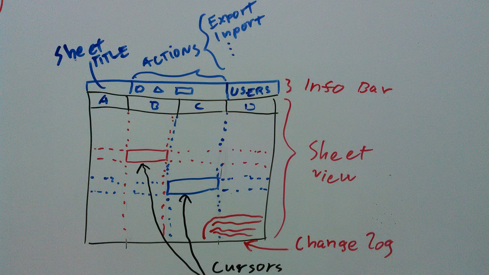

node-calc
=========

*node-calc* is a node.js web interface for
[hcalc](https://github.com/SimSaladin/hcalc). Horribly inefficient and the app
is most likely full of holes as this is just hacked together.

Why I wrote this? I decided to try doing things the mainstream way. In javascript 
and a bunch of its popular libraries I hear about everywhere. The result?
Nights of frustration, stupid bugs and (imho) bad library designs (For
example, I couldn't find a node CSV library which would preserve order in
fields). Oh, and did I mention out-of-date, incomplete and cryptic docs with
most tools? (Yes, I love haddocks and miss them in all other languages).

Anyways, here is a list of things that can be done in this app:

- Import and export csv files.
- Edit any cell in any sheet.
- Edits by others are propageted to the sheet in real-time.
- Cells can be either strings, numerals or simple formulas.
- Formulas are written between dollars: `$formula$`.
- The (hcalc-specific) formulas support currently these operations:
   * `A1`...`ZN` refer to relative **numeral** fields. Letters for columns right
     and numbers for rows down.
   * `(sum A1:B1)` sums all numeral fields defined by a rectangle with points A1
     and B1.
- Formulas that refer to non-numeral fields produce undefined behaviour.
- Sheets can be saved to server.
- The formulas can be calculated and whole output seen in the app.
- Both the CSV and results can be downloaded as files.

In addition, the app most likely allows anyone to launch missiles everywhere
every time. (It probably launches them out of its own will sometimes. I am too
terrified to test it.)

Install
-------

### Dependencies

node-calc requires these executables in path:

- npm
- grunt
- ruby
- compass (install via `gem install compass`)
- hcalc (see below)

node-calc uses grunt and bower for most of its dependencies.

### Installing hcalc

`hcalc` is the overcomplicated overly simplistic spreadsheet toolkit of mine.
Originally written as a overkill solution for the *lapio*-course it now serves
as external backend service for node-calc.

*Sidenote: If you asked me to write an interface for hcalc I definetely would
not do it javascript. I admit I run out of ideas here for this course :)*

installing `hcalc` is super-easy once you have a recent Haskell Platform or
equivalent installed:

    git clone https://github.com/SimSaladin/hcalc.git
    cd hcalc
    cabal sandbox init
    cabal install
    cd ~/bin && ln -s ../hcalc/.cabal-sandbox/bin/hcalc .

Adjust the last line to your preferences. Make sure the ~/bin is in $PATH.

### Running in development mode

node-calc is split in two: backend functionality (socket.io and hcalc) in
`node-calc-server` and web interface in `node-calc-web`.

To run the backend:

    cd node-calc-server
    npm install
    foreman start # or node server.js

By default the backend listens on 3000, but $PORT takes precedence.

---

To build and run the web interface:

    cd node-calc-web
    grunt test
    grunt serve

The second command starts your browser in http://localhost:9000.

### Production

Now, **please** do not run this on a production server without proper
sandboxing or someone **will** launch the missiles!

There are Procfiles for deploying to heroku in `node-calc-{server,web}` for the
backend and web interface, respectively.

Development notes
-----------------

__Activity log resides in [activity_log.md](activity_log.md)__.

- UI and interactions with **AngularJS**
- Server-side app including real-time communication between server and clients **express.io**

Main UI components:

- info bar at top
   * title of current sheet
   * actions: export, import
   * list of users
- Sheet view
   * Static row and column labels
   * Dynamic user cursors
- Changelog at bottom

UI sketch below:

### About the directory structure

**app/** Static files and the UI.

**server/index.js** The node app (express, socket.io, hcalc integ.)

**sheets/** Directory for the spreadsheets (yes, hardcoded).

**test/** The unwritten tests.

### List of tasks

Task | Completed?
--- | ---
Setup necessary NodeJS frameworks                      | Done
Setup (socket.io?) multiuser collaborative stuff       | Done
Spreadsheet column rendering in browser                | Done
Spreadsheet edit                                       | Done
Concurrent edits: updates from users' edits            | Done
Import csv's from the web interface                    | Done
Export csv from browser (with formulas or with values) | Done
Write install instructions                             | Started
Setup in heroku or somewhere                           | n
hcalc: Extend and document the DSL                     | (Too OT)
hcalc: import/export csv (formulas or with values!)    | Done

-----

**Disclaimer:** *I think I had absolutely no idea what I was actually doing 90%
of the time I spent on this.* Feel free to rant me away all you want via
whatever channel you may prefer.
